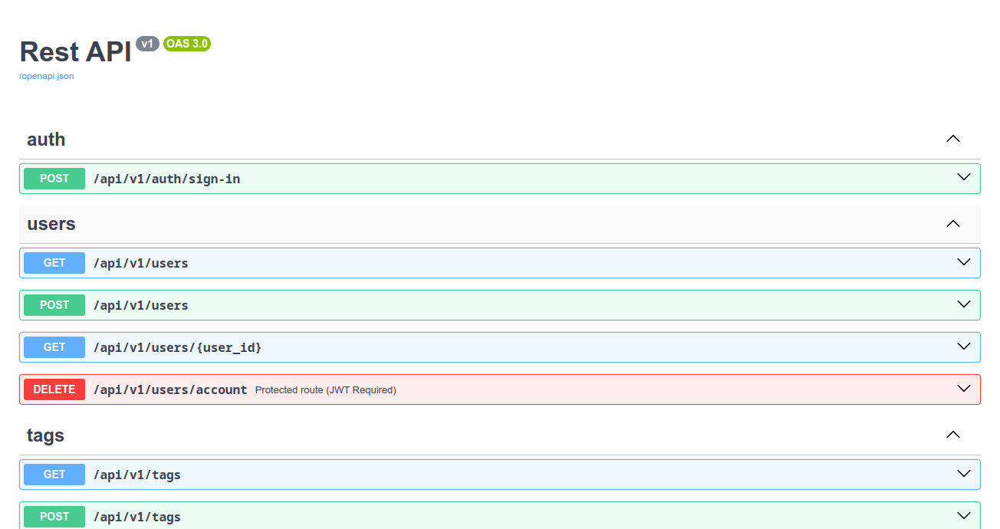
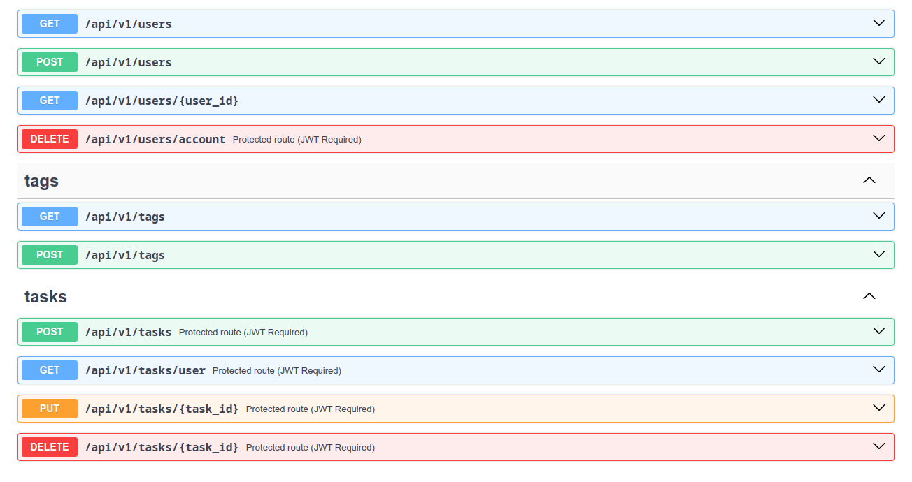
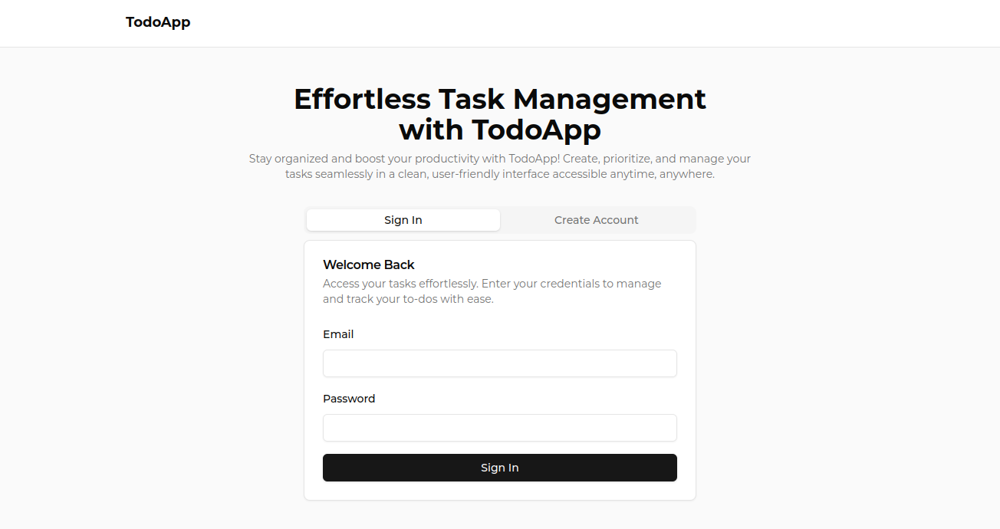
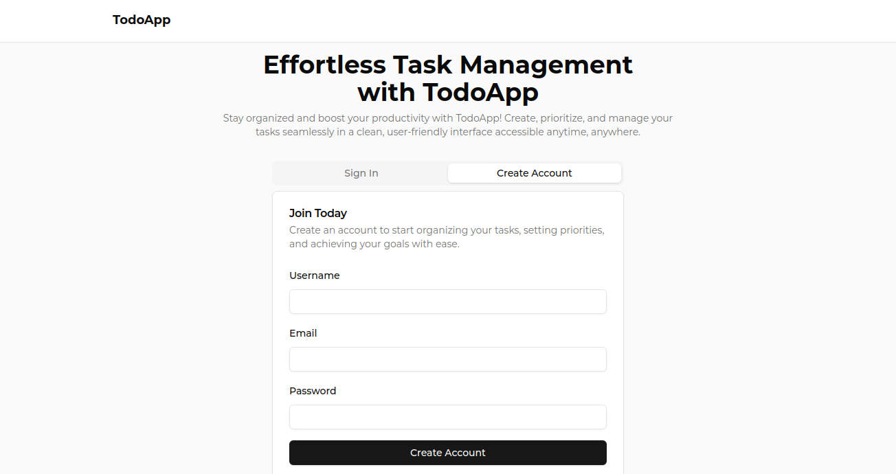
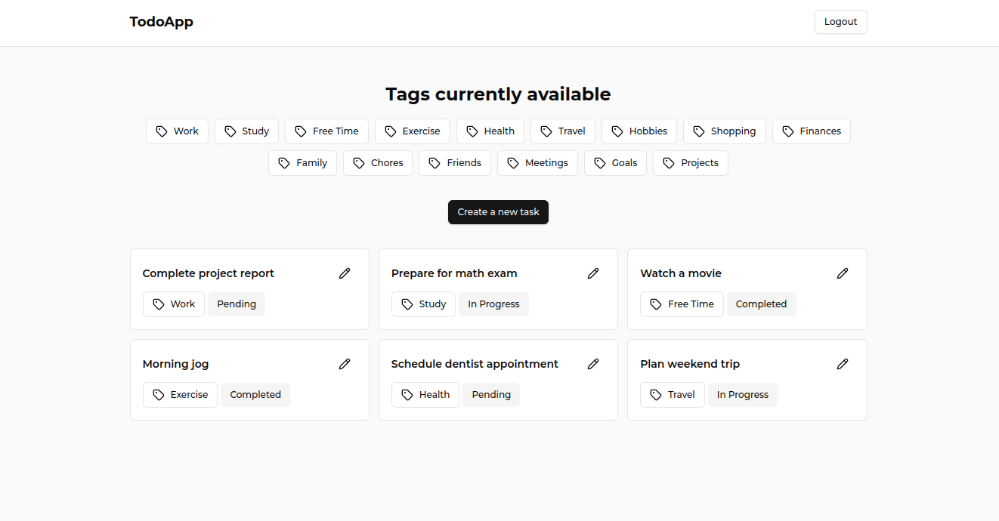
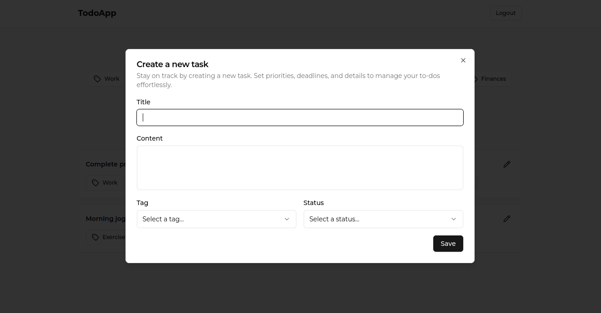
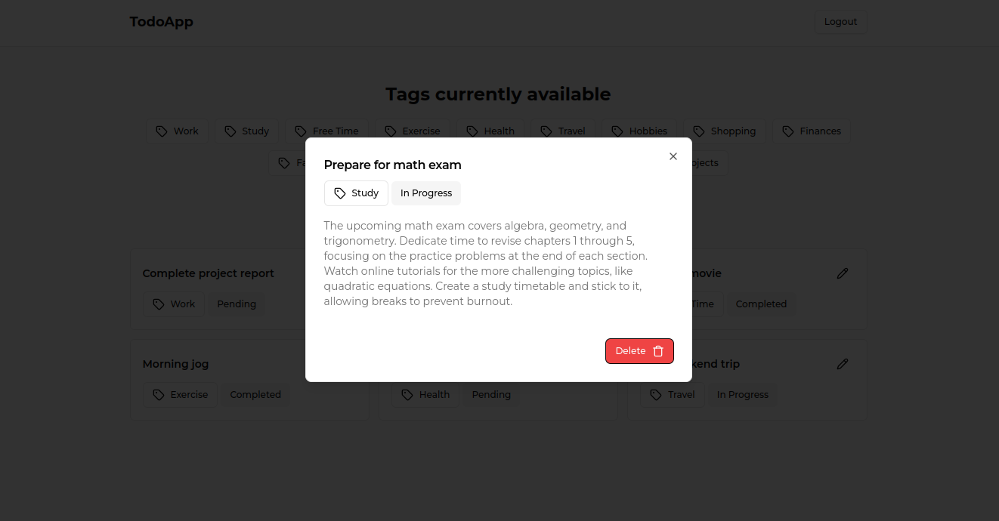
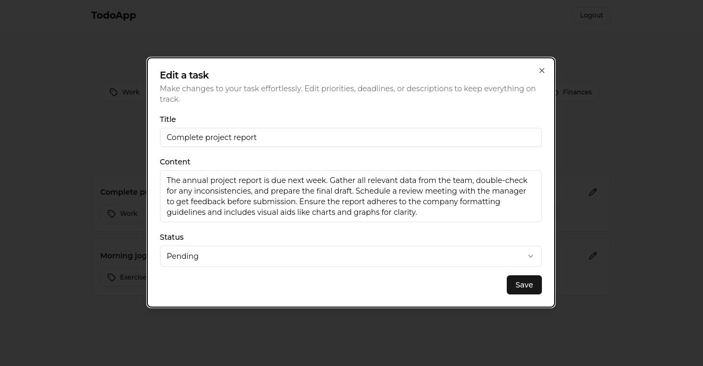

# TODO App built with Flask and ReactJS

This is an web app with the objective of being able to save your notes and have them stored in a database. The user is able to perform basic actions such as create, read, update and delete this data, a basic CRUD.

## Table of contents

- [Built with](#built-with)
- [Project requirements and how to use it](#project-requirements-and-how-to-use-it)
  - [REST API](#rest-api)
- [Image gallery](#image-gallery)
  - [REST API](#rest-api-preview)
  - [Frontend](#frontend-preview)

## Built with

The project was developed from scratch with Frontend and Backend technologies, for the communication between the client and the server I implemented a REST API, which is responsible for returning the necessary data in JSON format to the client:

- Frontend:
  - ReactJS
  - TypeScript
  - TailwindCSS
  - Axios
  - ShadcnUI
  - React Router Dom
  - React Hook Form
  - Zustand
  - React Query

- Backend:
  - Python (Flask)
  - SQLite (As database manager)
  - Flask Migrate (To perform migrations)
  - SQLAlchemy and Flask SQLAlchemy (Python SQL toolkit and ORM that gives application developers the full power and flexibility of SQL)
  - REST API (For communication between client and server)
  - SwaggerUI
  - Flask Smorest (Used for rest api creation and schema creation)
  - Flask JWT Extended (For the creation of JWT)
  - MVC (Software Design Pattern)

## Project requirements and how to use it

For the project you must run both development environments at the same time, both the Frontend and the Backend. In the Frontend you will find JavaScript technologies (ReactJS) and in the Backend you will find Python technologies and tools (Flask), so you must have NodeJS and Python installed on your computer (As a reference this project was developed with version 3.13.0 of Python and 22.11.0 of NodeJS).

I leave you links to NodeJS and Python for installation:
  - [NodeJS website](https://nodejs.org/en/)
  - [Python website](https://www.python.org/)

First of all download the project to start using it, do it from the terminal:

```shell
$ git clone https://github.com/Remy349/todo-app-flask-reactjs.git

$ cd todo-app-flask-reactjs
```

If you did it correctly and there were no problems, you should see these folders:

```shell
/backend
/frontend
/preview
README.md
```


### REST API

Everything related to the API is inside `flaskr/routes`. The following table summarizes the routes that were implemented:

| HTTP Method | Resource URL            | Notes                                   |
| ----------- | ----------------------- | --------------------------------------- |
| `POST`      | */api/v1/auth/sign-in*  | Auth user and create JWT                |
| `GET`       | */api/v1/users*         | Get a list of all users                 |
| `POST`      | */api/v1/users*         | Create a new user                       |
| `GET`       | */api/v1/users/id*      | Get a single user by id                 |
| `DELETE`    | */api/v1/users/account* | Delete a user account                   |
| `GET`       | */api/v1/tags*          | Get a list of tags                      |
| `POST`      | */api/v1/tags*          | Create a new tag                        |
| `POST`      | */api/v1/tasks*         | Create a new task                       |
| `GET`       | */api/v1/tasks/user*    | Get a list of all tasks on user         |
| `PUT`       | */api/v1/tasks/id*      | Update a task                           |
| `DELETE`    | */api/v1/tasks/id*      | Delete a task                           |

## Image gallery

### REST API Preview:




### Frontend Preview








### Developed by Santiago de Jesús Moraga Caldera - Remy349(GitHub)
